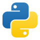

<div align="center">

# 🎯 Claude Codex Skills Directory

**Koleksi Keahlian Engineering Elite untuk Claude AI**

Ubah Claude menjadi senior/lead engineer dengan pengalaman produksi 20+ tahun di 8 domain spesialisasi

[](LICENSE)
[](#-daftar-skills)
[](#-struktur-repositori)
[](#)
[](#-kontribusi)

[Mulai Cepat](#-mulai-cepat) • [Daftar Skills](#-daftar-skills) • [Contoh Penggunaan](#-contoh-penggunaan) • [Kontribusi](#-kontribusi)

</div>

---

## Apa Ini?

**Claude Codex Skills Directory** adalah koleksi komprehensif dari 8 sistem keahlian tingkat master yang mengubah Claude AI menjadi senior/lead engineer kelas dunia di berbagai domain teknologi. Setiap skill mewujudkan pengalaman produksi 20+ tahun dengan pola-pola yang terbukti di lapangan, anti-pattern yang harus dihindari, strategi debugging, dan framework pengambilan keputusan di dunia nyata.


## 📊 Statistik Singkat

| Metrik | Jumlah |
|--------|--------|
| **Total Skills** | 8 domain spesialisasi |
| **Dokumen Referensi** | 64+ panduan komprehensif |
| **Script Otomasi** | 8 helper tools |
| **Teknologi yang Dicakup** | 30+ framework dan library |
| **Level Keahlian** | 20+ tahun senior/lead engineer per skill |
| **Dokumentasi** | 10.000+ baris pengetahuan teruji di produksi |


## 🎓 Daftar Skills

<table>
  <tr>
    <td align="center" width="25%">
      
      <br/>
      <b>AI/ML Mastery</b>
      <br/>
      <sub>PyTorch • TensorFlow • LLMs</sub>
      <br/>
      <a href="ai-ml-mastery-skill/">📚 Docs</a>
    </td>
    <td align="center" width="25%">
      
      <br/>
      <b>Bun.js + Docker</b>
      <br/>
      <sub>TypeScript • Hono • Drizzle</sub>
      <br/>
      <a href="bunjs-mastery-skill/">📚 Docs</a>
    </td>
    <td align="center" width="25%">
      
      <br/>
      <b>Golang Mastery</b>
      <br/>
      <sub>Chi • SQLX • Concurrency</sub>
      <br/>
      <a href="golang-mastery-skill/">📚 Docs</a>
    </td>
    <td align="center" width="25%">
      
      <br/>
      <b>Nuxt.js + TanStack</b>
      <br/>
      <sub>Vue 3 • Nuxt 3 • Query</sub>
      <br/>
      <a href="nuxtjs-mastery-skill/">📚 Docs</a>
    </td>
  </tr>
  <tr>
    <td align="center" width="25%">
      
      <br/>
      <b>RabbitMQ Mastery</b>
      <br/>
      <sub>AMQP • Clustering • HA</sub>
      <br/>
      <a href="rabbitmq-mastery-skill/">📚 Docs</a>
    </td>
    <td align="center" width="25%">
      
      <br/>
      <b>React + TanStack</b>
      <br/>
      <sub>Router • Query • Table • Form</sub>
      <br/>
      <a href="react-tanstack-mastery-skill/">📚 Docs</a>
    </td>
    <td align="center" width="25%">
      
      <br/>
      <b>Rust Mastery</b>
      <br/>
      <sub>Axum • SQLX • Memory Safety</sub>
      <br/>
      <a href="rust-mastery-skill/">📚 Docs</a>
    </td>
    <td align="center" width="25%">
      
      <br/>
      <b>SolidJS + SolidStart</b>
      <br/>
      <sub>Fine-Grained Reactivity</sub>
      <br/>
      <a href="solidjs-solidstart-mastery-skill/">📚 Docs</a>
    </td>
  </tr>
</table>


## 🚀 Mulai Cepat

### Menggunakan Satu Skill
1. Arahkan Claude ke direktori skill yang relevan (contoh: `ai-ml-mastery-skill/`)
2. Claude akan mengadopsi persona dan keahlian yang didefinisikan di `SKILL.md`
3. Referensikan file di folder `references/` untuk pengetahuan mendalam

### Menggunakan Beberapa Skills
Muat beberapa skills untuk proyek lintas domain:
```
- golang-mastery-skill (backend API)
- react-tanstack-mastery-skill (frontend)
- rabbitmq-mastery-skill (message broker)
```

### Contoh Prompt
```
"Muat skill AI/ML mastery dan bantu saya membangun model sentiment analysis
production-ready menggunakan PyTorch. Sertakan error handling yang proper,
logging, dan konfigurasi deployment Docker."
```


## 📝 Contoh Penggunaan

### Contoh 1: AI/ML - Membangun Sentiment Analysis dengan PyTorch

**Skenario**: Anda membutuhkan model sentiment analysis siap produksi

**Muat Skill**: `ai-ml-mastery-skill`

**Tanya Claude**:
```
"Buatkan model sentiment analysis menggunakan PyTorch dan transformers.
Sertakan:
- Training loop yang proper dengan validasi
- Error handling dan logging
- Model checkpointing
- Konfigurasi deployment Docker
- API endpoint untuk inferensi"
```

**Output yang Diharapkan**: Claude akan memberikan implementasi level expert dengan:
- Kode PyTorch yang clean mengikuti best practices
- Arsitektur berbasis transformer (BERT/RoBERTa)
- Error handling siap produksi
- Pola deployment MLOps
- Tips optimasi performa

---

### Contoh 2: Full-Stack - Arsitektur Microservices

**Skenario**: Membangun sistem microservices dengan komunikasi async

**Muat Skills**:
- `golang-mastery-skill` (backend services)
- `react-tanstack-mastery-skill` (frontend dashboard)
- `rabbitmq-mastery-skill` (message broker)

**Tanya Claude**:
```
"Desain arsitektur microservices untuk platform e-commerce dengan:
- Backend services Go (orders, inventory, payments)
- RabbitMQ untuk komunikasi async
- React frontend dengan TanStack Query
- Setup Docker Compose"
```

**Output yang Diharapkan**: Claude akan mendesain:
- Arsitektur microservices Go yang clean
- Pola messaging RabbitMQ (work queues, pub/sub, RPC)
- React frontend dengan state management yang proper
- Setup Docker siap produksi
- Desain API dan error handling

---

### Contoh 3: Code Review - Production Readiness Rust

**Skenario**: Review codebase Rust yang ada untuk deployment produksi

**Muat Skill**: `rust-mastery-skill`

**Tanya Claude**:
```
"Review codebase Rust ini untuk kesiapan produksi. Cek:
- Isu memory safety dan potential panics
- Error handling yang proper dengan thiserror/anyhow
- Performance bottlenecks
- Vulnerability keamanan
- Pelanggaran clean code
- Missing test coverage"
```

**Output yang Diharapkan**: Claude akan memberikan review level senior dengan:
- Identifikasi pola unsafe
- Perbaikan error handling
- Saran optimasi performa
- Rekomendasi security hardening
- Analisis test coverage
- Saran refactoring


## 💡 Fitur Utama

- **Pola Teruji di Lapangan**: Solusi terbukti dari sistem produksi nyata
- **Anti-Pattern Terdokumentasi**: Pelajari apa yang TIDAK boleh dilakukan dan mengapa
- **Framework Pengambilan Keputusan**: Panduan jelas untuk pilihan arsitektur
- **Prinsip KISS**: Keep It Simple, Stupid - tanpa over-engineering
- **Enforcement YAGNI**: You Aren't Gonna Need It - bangun yang diperlukan saja
- **Explicit over Implicit**: Kode yang jelas dan mudah dibaca tanpa magic
- **Fokus Production-Ready**: Security, error handling, logging, monitoring
- **Library Terkurasi**: Dependency teruji di lapangan, bukan eksperimen trendy
- **Panduan Debugging**: Strategi troubleshooting sistematis
- **Standar Code Review**: Checklist review level senior


## 📖 Filosofi & Nilai

Semua skills mengikuti prinsip inti berikut:

### 1. KISS - Keep It Simple, Stupid
- Kesederhanaan daripada kepintaran
- Kode yang readable daripada kode "pintar"
- Teknologi membosankan yang bekerja

### 2. YAGNI - You Aren't Gonna Need It
- Tanpa optimasi prematur
- Bangun untuk kebutuhan hari ini
- Tambahkan kompleksitas hanya saat terbukti perlu

### 3. Explicit over Implicit
- Nama variabel yang jelas
- Tanpa magic atau DSL tersembunyi
- Alur kode yang jelas

### 4. Production-Ready Secara Default
- Error handling yang proper
- Logging dan monitoring
- Security hardening
- Performance testing

### 5. Teknologi Teruji di Lapangan
- Library dan framework yang terbukti
- Stabilitas daripada bleeding edge
- Dukungan komunitas dan dokumentasi


## 📂 Struktur Repositori

```
claude-codex-skills-directory/
├── README.md                           # Dokumentasi utama (English)
├── README_ID.md                        # Dokumentasi Indonesia (file ini)
├── assets/
│   └── logos/                          # Logo teknologi
│       ├── python.svg
│       ├── bun.svg
│       ├── golang.svg
│       ├── nuxt.svg
│       ├── rabbitmq.svg
│       ├── react.svg
│       ├── rust.svg
│       └── solidjs.svg
│
├── ai-ml-mastery-skill/
│   ├── SKILL.md                        # Panduan keahlian AI/ML
│   └── references/                     # 9 dokumen deep-dive
│       ├── deep-learning.md            # PyTorch, TensorFlow, JAX
│       ├── transformers-llm.md         # LLMs, fine-tuning, PEFT
│       ├── computer-vision.md          # Object detection, segmentation
│       ├── machine-learning.md         # sklearn, XGBoost, ensembles
│       ├── nlp.md                      # Text processing, embeddings
│       ├── mlops.md                    # Deployment, monitoring
│       ├── clean-code.md               # Patterns, anti-patterns
│       ├── debugging.md                # Profiling, optimization
│       └── data-engineering.md         # pandas, polars, dask
│
├── bunjs-mastery-skill/
│   ├── SKILL.md                        # Panduan dalam Bahasa Indonesia
│   ├── references/                     # 4 referensi
│   │   ├── clean-code-patterns.md      # Design patterns
│   │   ├── debugging-guide.md
│   │   ├── docker-patterns.md          # Advanced Docker
│   │   └── testing-strategy.md
│   ├── scripts/                        # 2 script otomasi
│   │   ├── init-project.sh             # Bootstrap project
│   │   └── healthcheck.ts              # Template health check
│   └── assets/                         # Template project
│       └── project-template/           # Boilerplate lengkap
│           ├── src/
│           │   ├── index.ts
│           │   ├── app.ts
│           │   ├── config/
│           │   ├── routes/
│           │   ├── controllers/
│           │   ├── services/
│           │   ├── repositories/
│           │   ├── middlewares/
│           │   └── utils/
│           └── docker/
│               └── Dockerfile
│
├── golang-mastery-skill/
│   ├── SKILL.md                        # Panduan dalam Bahasa Indonesia
│   ├── references/                     # 10 referensi
│   │   ├── patterns.md                 # Design patterns
│   │   ├── anti-patterns.md            # Kesalahan umum
│   │   ├── concurrency.md              # Goroutines, channels
│   │   ├── docker.md                   # Template Dockerfile
│   │   ├── libraries.md                # Package teruji
│   │   ├── coding-standards.md         # Go idioms
│   │   ├── debugging.md                # Profiling, tracing
│   │   ├── code-review.md              # Checklist review
│   │   ├── project-structure.md        # Organisasi folder
│   │   └── examples.md                 # Contoh kode
│   └── scripts/
│       └── init_project.py             # Project scaffolder
│
├── nuxtjs-mastery-skill/
│   ├── SKILL.md                        # Panduan dalam Bahasa Indonesia
│   └── references/                     # 8 referensi
│       ├── folder-structure.md         # Layout project
│       ├── tanstack-query.md           # Pola data fetching
│       ├── clean-code.md               # Pola Vue
│       ├── performance.md              # Optimasi
│       ├── debugging.md                # Vue DevTools
│       ├── common-pitfalls.md          # Bug reaktivitas
│       ├── security.md                 # XSS, auth
│       └── libraries.md                # Ekosistem Vue
│
├── rabbitmq-mastery-skill/
│   ├── MANIFEST.json                   # Metadata skill
│   ├── SKILL.md
│   ├── references/                     # 6 referensi
│   │   ├── patterns.md                 # Pola messaging
│   │   ├── clustering.md               # Konfigurasi HA
│   │   ├── monitoring.md               # Setup Prometheus
│   │   ├── performance.md              # Panduan tuning
│   │   ├── security.md                 # Security hardening
│   │   └── troubleshooting.md          # Diagnosis masalah
│   └── scripts/                        # 3 script Python
│       ├── package_skill.py
│       ├── async_publisher.py          # Publisher high-throughput
│       └── connection_pool.py          # Manajemen koneksi
│
├── react-tanstack-mastery-skill/
│   ├── SKILL.md                        # Panduan dalam Bahasa Indonesia
│   └── references/                     # 9 referensi
│       ├── folder-structure.md         # Layout project
│       ├── tanstack-query.md           # Server state
│       ├── tanstack-router.md          # Type-safe routing
│       ├── tanstack-table.md           # Data tables
│       ├── tanstack-form.md            # Form handling
│       ├── tanstack-start.md           # Full-stack SSR
│       ├── recommended-libraries.md    # Pemilihan dependency
│       ├── common-pitfalls.md          # Bug React
│       └── debugging-guide.md          # DevTools & profiling
│
├── rust-mastery-skill/
│   ├── SKILL.md                        # Panduan dalam Bahasa Indonesia
│   ├── references/                     # 6 referensi
│   │   ├── advanced-patterns.md        # Design patterns
│   │   ├── senior-habits.md            # Best practices
│   │   ├── debugging-guide.md          # Profiling, tracing
│   │   ├── code-review-guide.md        # Checklist review
│   │   ├── trusted-libraries.md        # Panduan ekosistem
│   │   └── bug-prevention.md           # Anti-patterns
│   ├── scripts/
│   │   └── scaffold_project.py         # Generator project
│   └── assets/
│       └── github-ci.yml               # Template CI/CD
│
└── solidjs-solidstart-mastery-skill/
    ├── SKILL.md                        # Panduan dalam Bahasa Indonesia
    └── references/                     # 5 referensi
        ├── debugging.md                # DevTools & troubleshooting
        ├── performance.md              # Optimasi bundle
        ├── patterns.md                 # Design patterns
        ├── security.md                 # Auth & security
        └── testing.md                  # Strategi testing
```


## 🔧 Detail Setiap Skill

### 🐍 AI/ML Mastery

<details>
<summary><b>Klik untuk expand</b> - PyTorch, TensorFlow, LLMs, Computer Vision, NLP</summary>

#### Overview
Elite AI/ML Senior Engineer dengan pengalaman 20+ tahun (level DeepMind/OpenAI/Anthropic). Mengubah Claude menjadi AI researcher dan engineer kelas dunia yang mampu membangun sistem ML/DL produksi dari nol.

#### Isi Paket
- **SKILL.md**: Panduan keahlian inti dengan framework keputusan
- **Referensi** (9 file):
  - **Deep Learning**: Arsitektur PyTorch, TensorFlow, JAX
  - **Transformers & LLMs**: Fine-tuning, PEFT, LoRA, mekanisme attention
  - **Computer Vision**: Object detection, segmentation, GANs, CNNs
  - **Machine Learning**: sklearn, XGBoost, feature engineering, ensembles
  - **NLP**: Embeddings, sentiment analysis, NER, classification
  - **MLOps**: Deployment, monitoring, Docker, CI/CD
  - **Clean Code**: Patterns, anti-patterns, testing
  - **Debugging**: Profiling, optimization, troubleshooting
  - **Data Engineering**: pandas, polars, dask, data pipelines

#### Kemampuan Utama
- Bangun model ML/DL produksi dari nol
- Desain arsitektur neural network custom
- Fine-tune LLMs (BERT, GPT, Llama) dengan PEFT/LoRA
- Implementasi pipeline computer vision (detection, segmentation)
- Sistem NLP (embeddings, transformers, classification)
- Deployment MLOps dengan Docker dan monitoring
- Optimasi performa dan debugging
- Engineering pipeline data

#### Kata Kunci Trigger
`ML`, `AI`, `deep learning`, `transformer`, `LLM`, `PyTorch`, `TensorFlow`, `computer vision`, `NLP`, `neural network`

</details>

---

### 🍞 Bun.js + Docker Mastery

<details>
<summary><b>Klik untuk expand</b> - TypeScript, Bun Runtime, Hono, Drizzle ORM, Docker</summary>

#### Overview
Senior/Lead Developer dengan pengalaman 20 tahun di JavaScript/TypeScript modern. Expert dalam optimasi Bun.js runtime, clean architecture, dan deployment Docker produksi. **Panduan tersedia dalam Bahasa Indonesia**.

#### Isi Paket
- **SKILL.md**: Panduan keahlian inti (Bahasa Indonesia)
- **Referensi** (4 file):
  - **Clean Code Patterns**: Design patterns, prinsip SOLID
  - **Debugging Guide**: Troubleshooting sistematis
  - **Docker Patterns**: Multi-stage builds, optimasi
  - **Testing Strategy**: Unit, integration, E2E testing
- **Scripts** (2 file):
  - **init-project.sh**: Bootstrap project Bun.js baru
  - **healthcheck.ts**: Template health check endpoint
- **Assets**:
  - **Project Template**: Boilerplate production-ready lengkap dengan layered architecture

#### Kemampuan Utama
- Bangun API Bun.js berkinerja tinggi (framework Hono)
- Clean code architecture (controllers, services, repositories)
- Containerization Docker dengan multi-stage builds
- Integrasi database (Drizzle ORM, PostgreSQL)
- Pola error handling, validasi, logging
- Deployment dan optimasi produksi
- Code review dengan standar senior engineer

#### Kata Kunci Trigger
`Bun.js`, `Bun`, `TypeScript`, `Hono`, `Drizzle`, `Docker`, `JavaScript runtime`

</details>

---

### 🐹 Golang Mastery

<details>
<summary><b>Klik untuk expand</b> - Go, Chi Router, SQLX, Concurrency, Microservices</summary>

#### Overview
Golang Senior/Lead Developer dengan pengalaman 20+ tahun. Expert dalam Go idioms, pola concurrency, dan microservices production-grade. **Panduan tersedia dalam Bahasa Indonesia**.

#### Isi Paket
- **SKILL.md**: Panduan keahlian inti (Bahasa Indonesia)
- **Referensi** (10 file):
  - **Patterns**: Design patterns di Go (factory, singleton, middleware)
  - **Anti-Patterns**: Kesalahan umum yang harus dihindari
  - **Concurrency**: Goroutines, channels, race conditions, sync primitives
  - **Docker**: Multi-stage builds, Alpine images, optimasi
  - **Libraries**: Package teruji (Chi, SQLX, Viper, Zap)
  - **Coding Standards**: Go idioms, gofmt, golangci-lint
  - **Debugging**: pprof, tracing, profiling
  - **Code Review**: Checklist review level senior
  - **Project Structure**: Standard Go project layout
  - **Examples**: Contoh kode dunia nyata
- **Scripts**:
  - **init_project.py**: Project scaffolder dengan templates

#### Kemampuan Utama
- Bangun microservices Go production-grade
- Implementasi pola concurrency yang clean (tanpa race conditions)
- Desain RESTful APIs dengan error handling proper
- Integrasi database (SQLX, migrations)
- Containerization dan deployment Docker
- Profiling dan optimasi performa
- Code review dengan Go best practices

#### Kata Kunci Trigger
`Go`, `Golang`, `goroutine`, `channel`, `concurrency`, `microservice`, `Chi`, `SQLX`

</details>

---

### 💚 Nuxt.js + TanStack Mastery

<details>
<summary><b>Klik untuk expand</b> - Vue 3, Nuxt 3, Composition API, TanStack Query, Pinia</summary>

#### Overview
Senior/Lead Vue.js Developer dengan pengalaman 20 tahun. Expert dalam pengembangan full-stack Nuxt 3, integrasi TanStack Query, dan optimasi performa. **Panduan tersedia dalam Bahasa Indonesia**.

#### Isi Paket
- **SKILL.md**: Panduan keahlian inti (Bahasa Indonesia)
- **Referensi** (8 file):
  - **Folder Structure**: File-based routing dan organisasi Nuxt 3
  - **TanStack Query**: Server state management, caching, mutations
  - **Clean Code**: Pola composition Vue, composables, utilities
  - **Performance**: Code splitting, lazy loading, optimasi SSR
  - **Debugging**: Vue DevTools, source maps, error tracking
  - **Common Pitfalls**: Gotchas reaktivitas, hydration errors
  - **Security**: Pencegahan XSS, authentication, CSRF
  - **Libraries**: Ekosistem Vue terkurasi (Pinia, VueUse, Headless UI)

#### Kemampuan Utama
- Bangun aplikasi full-stack Nuxt 3 (SSR/SSG/SPA)
- Integrasikan TanStack Query untuk server state
- Implementasi pola composition API yang clean
- State management dengan Pinia
- Optimasi performa (Core Web Vitals)
- Security hardening (XSS, auth, CSRF)
- Deployment dan monitoring produksi

#### Kata Kunci Trigger
`Nuxt`, `Vue`, `Vue 3`, `Nuxt 3`, `TanStack Query`, `Pinia`, `composition API`, `SSR`

</details>

---

### 🐰 RabbitMQ Mastery

<details>
<summary><b>Klik untuk expand</b> - AMQP, Pola Message, Clustering, High Availability</summary>

#### Overview
Ultimate RabbitMQ Expert (Top 0.01% knowledge). Master pola messaging advanced, high availability, performance tuning, dan troubleshooting produksi.

#### Isi Paket
- **SKILL.md**: Panduan keahlian inti
- **MANIFEST.json**: Metadata skill
- **Referensi** (6 file):
  - **Patterns**: Work queues, pub/sub, routing, topics, RPC, DLX, priority queues
  - **Clustering**: Quorum queues, stream queues, federation, shovel
  - **Monitoring**: Integrasi Prometheus, alerting, health checks
  - **Performance**: Tuning prefetch, batch publishing, flow control
  - **Security**: TLS/mTLS, OAuth2, LDAP, isolasi vhost
  - **Troubleshooting**: Isu memory, connection leaks, pertumbuhan queue
- **Scripts** (3 file):
  - **async_publisher.py**: Publisher async high-throughput
  - **connection_pool.py**: Pola connection pooling
  - **package_skill.py**: Utility packaging skill

#### Kemampuan Utama
- Desain arsitektur messaging advanced
- Implementasi HA dengan quorum queues dan clustering
- Performance tuning (prefetch, batch, memory)
- Security hardening (TLS, auth, permissions)
- Monitoring dengan Prometheus
- Troubleshoot isu produksi
- Stream processing dengan RabbitMQ Streams

#### Kata Kunci Trigger
`RabbitMQ`, `AMQP`, `message queue`, `pub/sub`, `clustering`, `high availability`, `quorum queue`

</details>

---

### ⚛️ React + TanStack Mastery

<details>
<summary><b>Klik untuk expand</b> - React, TanStack Router, Query, Table, Form, Start</summary>

#### Overview
Senior React Developer dengan pengalaman 20 tahun. Expert dalam ekosistem TanStack (Router, Query, Table, Form, Start) dan pola React modern. **Panduan tersedia dalam Bahasa Indonesia**.

#### Isi Paket
- **SKILL.md**: Panduan keahlian inti (Bahasa Indonesia)
- **Referensi** (9 file):
  - **Folder Structure**: Organisasi project React (feature-based, layer-based)
  - **TanStack Query**: Server state, caching, mutations, optimistic updates
  - **TanStack Router**: Type-safe routing, loaders, prefetching
  - **TanStack Table**: Advanced data tables dengan sorting, filtering, pagination
  - **TanStack Form**: Type-safe forms, validation, field arrays
  - **TanStack Start**: Framework SSR full-stack (React Server Components)
  - **Recommended Libraries**: Ekosistem terkurasi (Zustand, React Hook Form, Radix UI)
  - **Common Pitfalls**: Aturan hooks, isu re-render, stale closures
  - **Debugging Guide**: React DevTools, profiler, error boundaries

#### Kemampuan Utama
- Bangun React SPAs dan SSR apps (TanStack Start)
- Type-safe routing dengan TanStack Router
- Server state management dengan TanStack Query
- Advanced data tables dengan TanStack Table
- Complex forms dengan TanStack Form
- Optimasi performa (memoization, lazy loading)
- Pola state management (Zustand, context)

#### Kata Kunci Trigger
`React`, `TanStack`, `TanStack Query`, `TanStack Router`, `TanStack Table`, `React hooks`, `SSR`

</details>

---

### 🦀 Rust Mastery

<details>
<summary><b>Klik untuk expand</b> - Rust, Axum, SQLX, Memory Safety, Systems Programming</summary>

#### Overview
Senior/Lead Rust Developer dengan pengalaman 20+ tahun di systems programming. Expert dalam memory safety, zero-cost abstractions, dan Rust services produksi. **Panduan tersedia dalam Bahasa Indonesia**.

#### Isi Paket
- **SKILL.md**: Panduan keahlian inti (Bahasa Indonesia)
- **Referensi** (6 file):
  - **Advanced Patterns**: Typestate, builder, new type, phantom data
  - **Senior Habits**: Pola ownership, lifetime best practices
  - **Debugging Guide**: lldb, rust-gdb, cargo flamegraph, memory profiling
  - **Code Review Guide**: Checklist level senior (safety, performance, idioms)
  - **Trusted Libraries**: Crates teruji (Axum, SQLX, Serde, tokio)
  - **Bug Prevention**: Anti-patterns, pitfalls umum, clippy lints
- **Scripts**:
  - **scaffold_project.py**: Generator project Rust
- **Assets**:
  - **github-ci.yml**: Template GitHub Actions CI/CD

#### Kemampuan Utama
- Bangun Rust services produksi (framework Axum)
- Systems programming memory-safe
- Async/await dengan Tokio runtime
- Integrasi database (SQLX dengan compile-time checks)
- Error handling (thiserror, anyhow)
- Optimasi performa (zero-cost abstractions)
- Deployment Docker dengan multi-stage builds

#### Kata Kunci Trigger
`Rust`, `Axum`, `SQLX`, `tokio`, `async`, `memory safety`, `systems programming`, `ownership`

</details>

---

### 🔷 SolidJS + SolidStart Mastery

<details>
<summary><b>Klik untuk expand</b> - SolidJS, Fine-Grained Reactivity, SolidStart, TanStack</summary>

#### Overview
Expert SolidJS Developer dengan pengalaman 20+ tahun. Master fine-grained reactivity, framework full-stack SolidStart, dan integrasi ekosistem TanStack. **Panduan tersedia dalam Bahasa Indonesia**.

#### Isi Paket
- **SKILL.md**: Panduan keahlian inti (Bahasa Indonesia)
- **Referensi** (5 file):
  - **Debugging**: Solid DevTools, debugging reaktivitas, source maps
  - **Performance**: Optimasi bundle, code splitting, lazy loading
  - **Patterns**: Signals, stores, resources, context, control flow
  - **Security**: Pola auth, pencegahan XSS, CSP
  - **Testing**: Solid Testing Library, unit tests, integration tests

#### Kemampuan Utama
- Bangun SolidJS SPAs dengan fine-grained reactivity
- Aplikasi full-stack SolidStart (SSR/SSG/streaming)
- Integrasikan ekosistem TanStack (Query, Router, Table)
- Optimasi performa (tanpa overhead virtual DOM)
- Pola error boundaries dan suspense
- Accessibility (ARIA, keyboard navigation)
- Deployment produksi

#### Kata Kunci Trigger
`SolidJS`, `Solid`, `SolidStart`, `fine-grained reactivity`, `signals`, `stores`, `SSR`

</details>


## 🤝 Kontribusi

Kami menyambut kontribusi untuk meningkatkan dan memperluas Claude Codex Skills Directory!

### Cara Berkontribusi

#### 1. Tambahkan Skill Baru
Buat skill mastery baru untuk domain teknologi:
- Ikuti struktur direktori skill (lihat di bawah)
- Sertakan SKILL.md komprehensif dengan panduan expertise
- Tambahkan dokumentasi referensi untuk deep dives
- Sediakan scripts atau templates (opsional)
- Submit PR dengan deskripsi jelas

#### 2. Tingkatkan Skill yang Ada
Perbaiki skills saat ini dengan:
- Dokumentasi referensi tambahan
- Update rekomendasi library
- Contoh kode dan pattern baru
- Perbaikan bug atau koreksi error
- Optimasi performa

#### 3. Laporkan Isu
- Menemukan error atau informasi usang? [Buka issue](../../issues)
- Sarankan fitur baru atau perbaikan
- Bagikan use case dan feedback Anda

### Struktur Direktori Skill

Setiap skill harus mengikuti struktur ini:

```
nama-skill/
├── SKILL.md                    # Definisi skill utama (WAJIB)
├── references/                 # Dokumentasi deep-dive (DIREKOMENDASIKAN)
│   ├── topik1.md
│   ├── topik2.md
│   └── ...
├── scripts/                    # Script otomasi (opsional)
│   └── helper.py
└── assets/                     # Templates, configs (opsional)
    └── template.yml
```

### Format Frontmatter SKILL.md

Setiap `SKILL.md` harus menyertakan frontmatter:

```yaml
---
name: identifier-skill
description: |
  Deskripsi detail kapan dan bagaimana menggunakan skill ini.
  Sertakan kata kunci trigger dan use cases.
  Jelaskan level expertise dan persona.
---
```

### Standar Kualitas Kode

- **Ikuti pola yang ada**: Pertahankan konsistensi dengan skills saat ini
- **Gunakan nama yang jelas**: Nama file dan fungsi yang deskriptif
- **Dokumentasikan logika kompleks**: Tambahkan komentar di mana diperlukan
- **Sertakan contoh**: Sampel kode praktis dari dunia nyata
- **Test sebelum submit**: Verifikasi semua kode dan markdown render dengan benar

### Proses Pull Request

1. **Fork** repository
2. **Buat feature branch**: `git checkout -b feature/nama-skill-baru`
3. **Commit perubahan**: `git commit -m 'Tambah skill baru: X'`
4. **Push ke branch**: `git push origin feature/nama-skill-baru`
5. **Buka Pull Request** dengan:
   - Judul yang jelas dan deskriptif
   - Deskripsi detail perubahan
   - Daftar file yang ditambah/dimodifikasi
   - Screenshot (jika applicable)
   - Referensi ke issue terkait (jika ada)

### Code of Conduct

- Bersikap hormat dan konstruktif
- Fokus pada kontribusi, bukan orangnya
- Sambut pendatang baru dan bantu mereka belajar
- Ikuti [Contributor Covenant](https://www.contributor-covenant.org/)

### Butuh Bantuan?

Jika Anda punya pertanyaan tentang kontribusi:
- Cek existing issues untuk pertanyaan serupa
- Buka issue baru dengan label `question`
- Review skills yang ada sebagai contoh


## 📥 Sumber Logo & Kredit

Semua logo adalah trademark pemilik masing-masing. Repository ini menggunakan logo untuk tujuan identifikasi saja.

### Atribusi Logo

| Logo | Nama File | Sumber | Lisensi |
|------|-----------|--------|---------|
| Python | `python.svg` | [python.org/community/logos](https://www.python.org/community/logos/) | PSF Trademark |
| Bun.js | `bun.svg` | [GitHub - oven-sh/bun](https://github.com/oven-sh/bun) | MIT |
| Go | `golang.svg` | [go.dev/brand](https://go.dev/blog/go-brand) | CC BY 4.0 |
| Vue/Nuxt | `nuxt.svg` | [nuxt.com/design-kit](https://nuxt.com/design-kit) | MIT |
| RabbitMQ | `rabbitmq.svg` | [rabbitmq.com/trademarks](https://www.rabbitmq.com/trademark-guidelines.html) | MPL |
| React | `react.svg` | [react.dev](https://react.dev/) | MIT |
| Rust | `rust.svg` | [rust-lang.org/media-guide](https://www.rust-lang.org/policies/media-guide) | CC-BY |
| SolidJS | `solidjs.svg` | [solidjs.com/media](https://www.solidjs.com/media) | MIT |

Semua nama produk, logo, dan brand adalah properti pemilik masing-masing. Semua nama perusahaan, produk, dan layanan yang digunakan dalam repository ini hanya untuk tujuan identifikasi. Penggunaan nama, logo, dan brand ini tidak mengimplikasikan endorsement.


## ❓ FAQ (Pertanyaan yang Sering Diajukan)

<details>
<summary><b>Bagaimana cara menggunakan skills ini dengan Claude?</b></summary>

Arahkan Claude ke direktori skill yang relevan (contoh: `ai-ml-mastery-skill/`) atau muat file spesifik. Claude akan mengadopsi persona dan expertise yang didefinisikan di `SKILL.md`. Anda juga bisa memuat beberapa skills untuk proyek lintas domain.

Contoh:
```
"Muat skill AI/ML mastery dan bantu saya mendesain arsitektur neural network"
```

</details>

<details>
<summary><b>Apakah bisa menggunakan beberapa skills sekaligus?</b></summary>

Ya! Muat beberapa skills untuk proyek kompleks. Contohnya:
- `golang-mastery-skill` + `rabbitmq-mastery-skill` untuk backend microservices
- `react-tanstack-mastery-skill` + frontend skills untuk full-stack apps
- Kombinasi apapun yang sesuai kebutuhan proyek Anda

</details>

<details>
<summary><b>Apakah skills ini cocok untuk production?</b></summary>

Sangat cocok. Setiap skill mewujudkan pengalaman produksi 20+ tahun dengan:
- Pola teruji dari sistem nyata
- Anti-pattern terdokumentasi untuk menghindari kesalahan umum
- Best practices security dan performance
- Strategi deployment produksi
- Panduan debugging dan troubleshooting

Ini BUKAN contoh mainan atau tutorial. Mereka merepresentasikan expertise senior/lead engineer.

</details>

<details>
<summary><b>Apa bedanya dengan prompt biasa atau dokumentasi?</b></summary>

Prompt biasa adalah instruksi sekali pakai. Skills adalah sistem expertise komprehensif dengan:
- **Pengetahuan Terstruktur**: Organisasi hierarkis (SKILL.md + references)
- **Framework Keputusan**: Panduan jelas untuk pilihan arsitektur
- **Pola Dunia Nyata**: Solusi teruji, bukan hanya teori
- **Anti-Patterns**: Apa yang TIDAK boleh dilakukan dan mengapa
- **Standar Code Review**: Ekspektasi kualitas level senior
- **Kurasi Library**: Dependency terbukti vs eksperimen
- **Fokus Produksi**: Security, performance, monitoring
- **Strategi Debugging**: Troubleshooting sistematis
- **Scripts & Templates**: Otomasi dan boilerplates

Anggap skills seperti menyewa senior engineer, bukan membaca docs.

</details>

<details>
<summary><b>Bisakah saya kontribusi skill sendiri?</b></summary>

Ya! Kami menyambut skill baru. Lihat section [Kontribusi](#-kontribusi) untuk:
- Persyaratan struktur direktori skill
- Format frontmatter SKILL.md
- Standar kualitas kode
- Proses pull request

Kami sangat menyambut skills di area yang belum tercakup (contoh: mobile development, databases, DevOps, security).

</details>

<details>
<summary><b>Mengapa beberapa skills dalam Bahasa Indonesia?</b></summary>

Beberapa skills (Bun.js, Golang, Nuxt.js, React, Rust, SolidJS) menyertakan panduan Bahasa Indonesia untuk melayani developer Indonesia. Konten teknis dan contoh kode bersifat universal, dengan teks penjelasan dalam Bahasa Indonesia untuk kejelasan.

</details>

<details>
<summary><b>Bagaimana cara menjaga skills tetap up to date?</b></summary>

Skills dipelihara oleh komunitas:
- Watch repository ini untuk updates
- Subscribe ke releases untuk versi skill baru
- Kontribusikan update saat menemukan informasi usang
- Buka issue untuk melaporkan pola atau library yang deprecated

Dokumen referensi setiap skill menyertakan informasi versi jika applicable.

</details>


## 📄 Lisensi

Proyek ini dilisensikan di bawah **MIT License**.

```
MIT License

Copyright (c) 2024 Claude Codex Skills Directory Contributors

Permission is hereby granted, free of charge, to any person obtaining a copy
of this software and associated documentation files (the "Software"), to deal
in the Software without restriction, including without limitation the rights
to use, copy, modify, merge, publish, distribute, sublicense, and/or sell
copies of the Software, and to permit persons to whom the Software is
furnished to do so, subject to the following conditions:

The above copyright notice and this permission notice shall be included in all
copies or substantial portions of the Software.

THE SOFTWARE IS PROVIDED "AS IS", WITHOUT WARRANTY OF ANY KIND, EXPRESS OR
IMPLIED, INCLUDING BUT NOT LIMITED TO THE WARRANTIES OF MERCHANTABILITY,
FITNESS FOR A PARTICULAR PURPOSE AND NONINFRINGEMENT. IN NO EVENT SHALL THE
AUTHORS OR COPYRIGHT HOLDERS BE LIABLE FOR ANY CLAIM, DAMAGES OR OTHER
LIABILITY, WHETHER IN AN ACTION OF CONTRACT, TORT OR OTHERWISE, ARISING FROM,
OUT OF OR IN CONNECTION WITH THE SOFTWARE OR THE USE OR OTHER DEALINGS IN THE
SOFTWARE.
```

Lihat file [LICENSE](LICENSE) untuk teks lisensi lengkap.


## 💬 Dukungan

### Mendapatkan Bantuan

- **Issues**: [Laporkan bug atau request fitur](../../issues)
- **Discussions**: [Tanya pertanyaan atau bagikan ide](../../discussions)
- **Pull Requests**: [Kontribusi perbaikan](../../pulls)

### Komunitas

- Star repository ini jika Anda merasa berguna
- Bagikan dengan developer dan praktisi AI lain
- Kontribusikan skills untuk teknologi yang Anda kuasai
- Berikan feedback pada skills yang ada

---

<div align="center">

**Dibangun dengan pengetahuan dari 20+ tahun production engineering**

Dibuat dengan ❤️ oleh komunitas

🌏 **Bahasa Lain**: [English](README.md) | **Bahasa Indonesia** (halaman ini)

[⬆ Kembali ke Atas](#-claude-codex-skills-directory)

</div>
